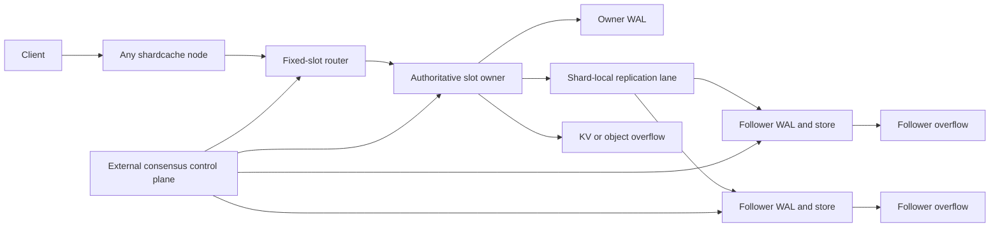

# Active-Active Replication Plan

## Summary

Build an active-active shardcache cluster in which every node can accept client
traffic and every node owns an exclusive subset of logical slots. A slot has
exactly one authoritative writer in a topology epoch and a configurable set of
replica nodes. Requests received by a non-owner are routed to the current
owner. This gives the cluster active use of every node without introducing
ambiguous concurrent writes to the same key.

The implementation should reuse the 0.6 shard-owned networking, fixed-slot
routing, FCRP mutation batches, watermarks, backlog catch-up, snapshots, TLS,
bounded queues, governance propagation, and topology handoff. It must add a
durable control plane, slot epochs, fencing, idempotent mutation identities,
replication acknowledgements, read consistency modes, failover, and safe slot
migration.

True multi-writer conflict resolution for the same slot is out of scope for the
first release. Last-writer-wins and generic CRDT behavior are not safe defaults
for Redis transactions, TTL changes, governed values, or arbitrary application
payloads.

## Goals

- Allow every cluster node to own slots and process reads and writes.
- Preserve one authoritative writer for each slot in a given epoch.
- Route requests received by any node to the authoritative slot owner.
- Replicate every authoritative mutation to a configurable number of followers.
- Support asynchronous, quorum, and all-replica write acknowledgement policies.
- Serve local replica reads under an explicit consistency policy.
- Fail over a slot without allowing the previous owner to continue writing.
- Rebalance slots online with bounded memory and network use.
- Preserve WAL, snapshot, TTL, governance, and overflow semantics.
- Keep queues, protocol frames, retry state, and retained tombstones bounded.
- Retain shard-local network ownership and avoid shared worker contention.

## Non-Goals

- Concurrent writers for the same slot or key.
- Automatic merging of conflicting Redis values or transactions.
- Cross-slot serializable transactions.
- A new general-purpose consensus implementation inside shardmap.
- Treating LRU overflow copies as durable active replicas.
- Allowing an isolated minority partition to acknowledge writes.
- Transparent compatibility with Redis Cluster administration commands in the
  first implementation.

## Consistency Model

### Slot Ownership

The cluster has a fixed power-of-two `slot_count`. Each slot assignment contains:

- `slot`
- `owner_node_id`
- `epoch`
- ordered `replica_node_ids`
- assignment state: `stable`, `preparing`, `cutover`, or `retiring`

Only the owner named by the latest committed assignment may originate a
mutation for the slot. Every mutation carries the assignment epoch. A receiver
rejects a mutation or forwarded write from an older epoch, even when its local
data version is newer than the incoming mutation sequence.

Each node may own many slots. The cluster is active-active at the node level,
while each slot remains single-writer.

The control plane stores adjacent assignments with identical ownership as
compact ranges. Each node expands the committed ranges into its local O(1)
slot table. Membership watches and lease renewal therefore scale with nodes and
assignment ranges, not with every individual slot. Splitting a range during
migration does not change any slot identity.

### Write Acknowledgement

Add these policies:

- `local`: acknowledge after local WAL admission and application.
- `quorum`: acknowledge after a majority of the total configured copies,
  including the owner, have durably admitted the mutation. With replication
  factor three, the owner plus either follower satisfies quorum.
- `all`: acknowledge after all copies in the configured replication factor,
  including the owner, have durably admitted the mutation.

`local` is the low-latency mode and may lose acknowledged writes if the owner
fails before replication. `quorum` is the production default for durable
active-active deployments. Queue admission must occur before local mutation
when the selected policy cannot safely enqueue the required replication work.

An acknowledgement means durable WAL admission unless persistence is explicitly
disabled. Memory application alone must never satisfy a durable acknowledgement
policy.

### Read Consistency

Add explicit read modes:

- `owner`: route to the current owner.
- `local_stale`: read a local replica without a lag guarantee.
- `bounded_staleness`: read locally only when the replica's applied watermark is
  within the configured sequence and time limits; otherwise route to the owner.
- `session`: require a client-provided minimum mutation token and route to a node
  that has applied at least that token.

The default is `owner`. No API should silently downgrade consistency when the
owner is unavailable.

### Mutation Identity And Ordering

Replace source-local `(shard_id, sequence)` identity for active-active traffic
with:

```text
(cluster_id, slot, epoch, owner_node_id, sequence)
```

The owner maintains a monotonically increasing sequence per slot or compact
slot group. Replicas persist the highest contiguous sequence and a bounded gap
set. Retries are idempotent. Duplicate mutations are acknowledged without
reapplication, and gaps trigger backlog catch-up or a slot snapshot.

Deletes and expiration produce tombstones. Tombstones include epoch and
sequence and remain until every assigned replica and retained migration target
has advanced beyond them, subject to a configured safety interval.

## Architecture



### Control Plane

Use an external consensus-backed control plane for membership, slot
assignments, epochs, and leases. The first adapter should support an embedded
test implementation and a production interface suitable for etcd or another
linearizable store. Shardcache must not implement an unproven consensus
algorithm as part of the data path.

`replication_factor` means total durable copies, including the owner. The
control plane uses one renewable node lease, or a bounded number of ownership
group leases, rather than one lease per slot. Losing a node lease fences all
assignments bound to that lease.

The control plane contract must provide:

- compare-and-swap assignment updates
- monotonic slot epochs
- lease acquisition and renewal
- owner fencing on lease loss
- membership health and stable node IDs
- watch or long-poll updates with revision numbers
- linearizable reads during failover and cutover

A node enters read-only degraded mode for affected slots before its ownership
lease expires. It must stop accepting new writes when it cannot prove that it
still owns the committed epoch.

### Data Plane

Create one `ActiveReplicationIo` runtime per local storage shard. It owns:

- the outbound connections for slots mapped to that local shard
- bounded mutation queues and completion lanes
- per-target ordered pipelines
- per-replica watermarks and retry state
- quorum completion tracking
- snapshot and backlog transfer state

No operation should require an endpoint-wide mutex or a shared global worker.
Connections may be shared by slots only when they are owned by the same local
shard runtime and target the same remote shard. A delayed target must not block
healthy targets or unrelated slots.

FCRP should gain a versioned active-replication capability rather than changing
version 1 semantics in place. The handshake must bind:

- cluster ID
- source and destination node IDs
- topology revision
- supported slot count
- protocol capabilities
- TLS peer identity
- maximum frame, batch, and snapshot chunk sizes

## Reuse From 0.6

The implementation should extend, not duplicate, these components:

- fixed logical slots and O(1) slot lookup
- shard-owned queues, drains, and direct-shard connections
- ordered, byte-capped mutation pipelines
- TLS 1.3, mTLS, token authentication, deadlines, and reconnect handling
- bounded frame decoding and allocation checks
- FCRP snapshot, mutation batch, acknowledgement, and error frames
- per-shard watermarks and retained backlog catch-up
- fallible snapshots and WAL recovery
- exact governance encoding and fail-closed reads
- KV overflow generation checks and acknowledged cold eviction
- topology identity validation and multi-address failover
- health snapshots, latency totals, and failure classification

Overflow and active replication remain separate layers. An active replica stores
authoritative replicated state and may only evict it when its WAL or lower
durable tier can reconstruct the value. An overflow owner remains a capacity
tier and is not counted toward replication quorum.

## Configuration Surface

Add a new `[active_replication]` section rather than overloading the existing
single-primary `[replication]` configuration:

```toml
[active_replication]
enabled = true
cluster_id = "production-a"
node_id = "cache-us-east-1a-01"
slot_count = 16384
replication_factor = 3
write_ack = "quorum"
read_consistency = "owner"
queue_capacity_per_shard = 4096
pipeline_max_items = 64
pipeline_max_bytes = 262144
pipeline_flush_micros = 50
max_inflight_per_target = 4
lease_ttl_ms = 5000
lease_renew_before_ms = 2000
tombstone_retention_seconds = 86400
max_replica_lag_sequences = 10000
max_replica_lag_ms = 1000

[active_replication.control_plane]
backend = "etcd"
endpoints = ["https://etcd-1:2379", "https://etcd-2:2379"]
namespace = "/shardcache/production-a"
username_env = "SHARDCACHE_ETCD_USERNAME"
password_env = "SHARDCACHE_ETCD_PASSWORD"

[active_replication.tls]
enabled = true
require_client_auth = true
cert_path = "/run/secrets/node.crt"
key_path = "/run/secrets/node.key"
ca_path = "/run/secrets/cluster-ca.crt"
```

Credential values must come from environment variables or secret files and
must be redacted from debug and health output. Non-loopback active replication
must require authenticated TLS unless an explicit private-overlay escape hatch
is enabled.

## Public APIs

Add routing and consistency options without changing existing embedded APIs:

```rust,ignore
pub enum ActiveWriteAck {
    Local,
    Quorum,
    All,
}

pub enum ActiveReadConsistency {
    Owner,
    LocalStale,
    BoundedStaleness,
    Session(MutationToken),
}

pub struct MutationToken {
    pub slot: u32,
    pub epoch: u64,
    pub sequence: u64,
}
```

Server requests may include consistency metadata in SCNP extensions. RESP
clients use configured defaults initially. Redis Cluster compatible `MOVED`
and `ASK` behavior should be a later compatibility layer over the same routing
table, not the source of truth for ownership.

## Slot Rebalancing

Use an explicit four-stage protocol:

1. **Prepare**: reserve a pending next epoch without changing the committed
   current epoch. The source remains the only writer under the current epoch.
   The destination installs a slot snapshot and catches up through the source
   backlog.
2. **Catch up**: destination reports a durable applied watermark. Source keeps
   sending live mutations and retains tombstones and backlog needed by the move.
3. **Cut over**: the control plane atomically fences the source and promotes the
   reserved next epoch, with the destination as owner. The destination may
   accept writes only after it observes the committed assignment and holds the
   lease. Replicas reject the source's previous-epoch mutations after this
   commit.
4. **Retire**: old copies remain readable only for repair until all routers have
   observed the cutover revision and the safety interval has elapsed.

Adding shards or nodes changes slot assignments, not slot identities. The
rebalancer should move bounded batches and limit concurrent moves per node and
per shard. It must expose pause, resume, and abort-before-cutover operations.
An interrupted move resumes from durable watermarks.

No request may use modulo node count or list position for ownership. Stable node
IDs and the committed slot table prevent slot reordering when membership
changes.

## Failure Semantics

### Owner Failure

The control plane waits for lease expiry or an explicit fenced transition,
selects a replica whose durable watermark satisfies the configured data-loss
policy, increments the slot epoch, and grants ownership. A stale owner rejects
writes as soon as it loses its lease and cannot regain ownership without a new
committed epoch.

### Replica Failure

Write behavior follows the acknowledgement policy. `quorum` continues while a
majority is available. The cluster marks under-replicated slots and schedules
repair to a replacement replica. `all` returns unavailable until every assigned
replica is durable.

### Network Partition

Only the partition containing the control-plane majority can grant or renew
ownership. Minority nodes serve only reads allowed by the configured stale-read
policy. They never acknowledge writes.

### Clock Skew And TTL

Mutation ordering must not depend on wall-clock time. TTL uses an absolute
expiry timestamp from the owner and is checked at every read. Deployments must
monitor clock skew because expiry is time-based, but skew cannot decide
ownership or resolve conflicts.

### Recovery

WAL and snapshots persist slot, epoch, sequence, tombstone, governance, and
origin identity. On restart a node loads local state but does not serve owner
writes until it confirms its assignments and leases with the control plane.
Replica recovery uses backlog catch-up when possible and a slot-scoped snapshot
otherwise.

## Governance And Security

- Governance metadata remains part of the atomic value version and replication
  checksum.
- Governed reads fail closed on owners, replicas, forwarded requests, snapshots,
  overflow fetches, and repair paths.
- A forwarded request carries authenticated caller context separately from
  stored governance metadata. Metadata itself is not an ACL.
- Cluster peers authenticate node ID through mTLS or a bound token identity.
- Protocol lengths, decompression ratios, gap sets, tombstones, pending quorum
  waiters, and snapshot staging are hard-bounded before allocation.
- Lease and epoch messages are accepted only from the configured control plane.
- Health and tracing output never include credentials, tokens, values, keys, or
  governance metadata.

## Observability

Expose cluster and per-slot-group health without requiring per-key cardinality:

- topology revision and control-plane connectivity
- owned, replicated, moving, unavailable, and under-replicated slot counts
- current epoch and lease remaining time by slot group
- routed and forwarded request counts and latency
- local, quorum, and all acknowledgement latency
- replica durable and applied lag in sequences, bytes, and milliseconds
- queue depth, pipeline size, bytes, RTT, retries, and reconnects per local shard
- duplicate mutations, gaps, stale-epoch rejects, and fenced-write rejects
- backlog catch-up and slot snapshot counts and bytes
- tombstone count, bytes, and oldest retained age
- rebalance stage, progress, throttling, failures, and estimated remaining bytes
- failover count, election duration, unavailable duration, and estimated data loss

## Implementation Phases

### Phase 1: Protocol And Local State Machine

- Introduce slot assignments, epochs, mutation IDs, tombstones, and durable
  replica watermarks.
- Add FCRP version 2 capability negotiation and active mutation frames.
- Implement idempotent application, stale-epoch rejection, gap detection, and
  slot-scoped snapshots.
- Build a deterministic in-memory control-plane adapter for tests.

### Phase 2: Shard-Owned Replication

- Add one `ActiveReplicationIo` runtime per local shard.
- Reuse direct-shard connections, bounded queues, byte-capped pipelines, TLS,
  and independent target progress.
- Implement `local`, `quorum`, and `all` completion tracking without a global
  acknowledgement mutex.
- Add backpressure before local mutation when admission cannot meet policy.

### Phase 3: Routing And Reads

- Add the O(1) committed slot table and request forwarding.
- Add owner, stale, bounded-staleness, and session read modes.
- Return explicit topology-stale and unavailable errors rather than silently
  serving weaker consistency.
- Preserve governance authorization across forwarding and replica reads.

### Phase 4: Control Plane And Failover

- Define the `ActiveReplicationControlPlane` trait.
- Implement a production etcd adapter behind a feature flag.
- Add leases, fencing, topology watches, failover selection, and repair.
- Validate cluster identity, slot count, node identity, and TLS capabilities at
  startup.

### Phase 5: Online Rebalancing

- Implement prepare, catch-up, cutover, and retire states.
- Add bounded slot snapshots and backlog retention for active moves.
- Add throttling, resumability, progress reporting, and rollback before cutover.
- Verify shard-count and node-count changes do not reorder unaffected slots.

### Phase 6: Overflow Integration And Release Hardening

- Permit active owners and replicas to use KV or object overflow without
  counting overflow copies toward replication quorum.
- Verify remote-only values materialize for snapshots, repair, and migration.
- Add rolling-upgrade compatibility, operator documentation, benchmarks, and
  production fault injection.

## Test Plan

### Unit And Model Tests

- Unique owner and replica coverage for fixed slot tables.
- Deterministic assignment across process restarts and membership order changes.
- Monotonic epochs and stale-owner fencing.
- Duplicate, reordered, missing, and conflicting mutation delivery.
- Tombstone retention and safe garbage collection.
- Quorum calculation for replica addition, removal, and failure.
- Governance and TTL preservation through every mutation type.
- Bounded allocation for malicious frames, gap sets, and pending waiters.
- State-machine model tests for prepare, catch-up, cutover, and retire.

### Integration Tests

- Three-node write/read replication with every node owning slots.
- Connect-to-any-node routing for SCNP and RESP.
- Owner crash before and after quorum acknowledgement.
- Stale owner restart and attempted writes after failover.
- Majority and minority network partitions.
- Replica lag under each read consistency mode.
- Backlog catch-up and slot snapshot fallback after restart.
- Online node and shard additions with no slot identity changes.
- Interrupted and resumed slot migration.
- Rolling upgrade with FCRP version negotiation.
- Active replicas backed by filesystem, S3/RustFS, and KV overflow.

Use deterministic network proxies and process-level fault injection for drops,
duplication, delay, corruption, half-open connections, and asymmetric
partitions. Tests must verify acknowledged write outcomes after recovery, not
only request return codes.

### Formal And Jepsen-Style Tests

- Model slot ownership, leases, epochs, and quorum acknowledgement in the
  existing formal support crate.
- Check single-writer safety, monotonic session reads, no stale-epoch commits,
  and no acknowledged-write loss under the documented quorum assumptions.
- Run a history checker for register, set, delete, expire, and compare-and-set
  workloads during failover and rebalancing.

### Performance Tests

- Embedded baseline versus active replication with factors 1, 2, and 3.
- Local, quorum, and all acknowledgement latency at 64 B, 1 KiB, and 64 KiB.
- One and sixteen local shards with one runtime per shard.
- Routed versus owner-local requests.
- Pipeline sizes 1, 16, and 64 under 0.1 ms, 1 ms, and 10 ms RTT.
- Healthy-target p99 while another target is delayed or unavailable.
- Failover recovery time and backlog catch-up throughput.
- Rebalance throughput with foreground read/write load.
- Idle and saturated memory use per connection, slot, tombstone, and waiter.

Run production benchmarks on Adam with separately pinned client, owner, and
replica CPU sets. Preserve raw results and exact commands under `benchmarks/`.

## Acceptance Gates

- No two healthy nodes can acknowledge writes as owner for the same slot epoch.
- A fenced owner cannot commit or replicate a mutation after cutover.
- Quorum-acknowledged writes survive any single-node failure at replication
  factor three.
- Minority partitions acknowledge no writes.
- Duplicate and reordered delivery produces the same final state as ordered
  exactly-once delivery.
- Node addition or removal does not change slot identity or move unaffected
  assignments.
- A delayed target increases healthy-target p99 by no more than 2x.
- Asynchronous primary enqueue throughput remains at least 90% of the embedded
  baseline while queues have capacity.
- Quorum mode adds no shared worker or global connection-lock contention.
- Idle user-space connection buffering remains at or below 16 KiB per socket
  pair unless TLS library requirements are documented separately.
- All queues, frames, snapshots, tombstones, and waiter collections have tested
  hard limits.
- `cargo fmt --check`, workspace tests, feature-matrix checks, rustdoc, and
  `cargo clippy --workspace --all-targets --all-features -- -D warnings` pass.

## Rollout

1. Ship protocol and state-machine code disabled by default.
2. Run shadow replication without serving reads or participating in failover.
3. Enable replica reads for noncritical bounded-staleness workloads.
4. Enable manual slot movement with automatic rollback before cutover.
5. Enable quorum writes and manual failover.
6. Enable automatic failover after partition and history-checker evidence is
   complete.
7. Enable automated rebalancing last, with conservative movement limits.

The existing single-primary replication and KV overflow modes remain supported
throughout the rollout. Active replication is a separate feature flag and
configuration surface until its compatibility and operational guarantees are
proven.

## Open Decisions

- Select the production control-plane backend and minimum supported version.
- Decide whether sequences are per slot or per fixed slot group after measuring
  memory and acknowledgement overhead.
- Define the first RESP surface for consistency selection and topology errors.
- Choose the default replication factor and acknowledgement policy for the
  server package.
- Set the maximum safe clock skew for bounded-staleness and TTL operations.
- Decide whether automatic failover may proceed from a non-quorum local write
  watermark or must require explicit operator acceptance of potential loss.
