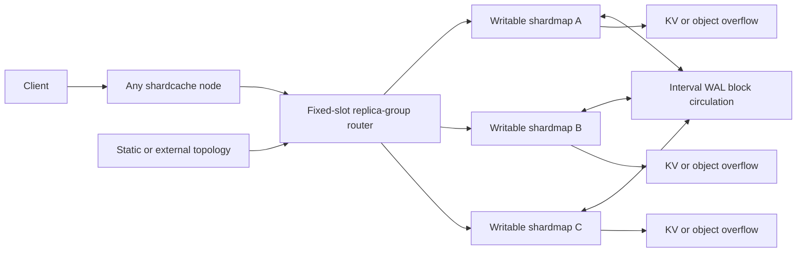

# Shardcache 0.7 Active-Active Replication

## Release Target

Active-active synchronization, causal conflict handling, independent residency
eviction, and exact cluster-eviction primitives are feature-gated for
Shardcache `0.7.0`. They are not part of the `0.6.x` API or compatibility
contract and do not affect the default `ShardMap` layout or hot path.

## Implementation Status

The `active-sync-causal-eventual` and
`active-sync-consensus-ordered-eventual` features provide `ActiveShardMap` for
exact byte keys and values. The consensus-ordered feature implies the causal
replication core, so callers select one outcome flag rather than naming an
ordering implementation. They include:

- per-shard mutation dots, hybrid logical clocks, compact causal contexts, and
  deterministic convergence for SET, DEL, expiry, and governed SET;
- remove-wins tombstones, exact-version cluster-eviction commits, independent
  local residency eviction, and exact peer fault-in;
- bounded immutable interval blocks, digests, retained-block frontiers,
  duplicate and out-of-order handling, and bounded state-transfer fallback;
- checksummed atomic snapshots that preserve values, tombstones, governance,
  TTLs, and causal state and fail when an evicted payload cannot be
  materialized;
- explicit in-process synchronization through `sync_with`;
- an `active-sync-tls` direct-shard transport with mandatory mutual TLS 1.3,
  ALPN, certificate-fingerprint authorization, deadlines, bounded frames,
  credential overlap, and immediate node revocation;
- revisioned automatic TLS membership reconciliation with one scheduler per
  local shard, bounded join catch-up, explicit draining, and health reporting;
  and
- focused fault, convergence, snapshot, compaction, mTLS, credential-rotation,
  and resource-bound tests plus the `active_sync_cost` benchmark.

### Consistency Modes

Select the public Cargo feature that names the required outcome:

| Cargo feature | Compiled guarantee | Conflict ordering |
| --- | --- | --- |
| `active-sync-causal-eventual` | Eventual convergence using causal dominance, remove-wins semantics, and deterministic HLC ordering | Local only |
| `active-sync-consensus-ordered-eventual` | Eventual convergence with an externally finalized total order for ambiguous conflicts | Pluggable `ConflictOrderer`; Blossom is one adapter |
| `active-sync-tls` | Direct-shard mTLS transport for either outcome | Transport only; implies the causal replication core |

`active-sync-consensus-ordered-eventual` can be passed by itself. Add
`active-sync-tls` when peers synchronize over the network. The feature name
does not claim linearizability or serializability.

Conflict ordering and peer synchronization are separate choices. The supported
deployment profiles are:

| Profile | Constructor | Peer sync | Concurrent conflict rule | Guarantee |
| --- | --- | --- | --- | --- |
| Embedded baseline | `EmbeddedStore::new` | None | None | Atomic local point operations only; no cross-node visibility. |
| `causal-local` | `ActiveShardMap::new_causal_eventual` | Off | Causal dominance, HLC tie-break, remove-wins DEL/expiry | Local read-your-writes and causal history; no remote visibility until the application synchronizes. |
| `consensus-local` | `ActiveShardMap::new_consensus_ordered_eventual` | Off | External finality for ambiguous conflicts | Same local guarantee, with consensus ready for conflicts imported by a later sync. It does not call consensus on conflict-free local writes. |
| `causal-sync` | `ActiveShardMap::new_causal_eventual` | Explicit or scheduled | Causal dominance, HLC tie-break, remove-wins DEL/expiry | Eventual convergence after finite writes and eventual successful delivery. |
| `consensus-sync` | `ActiveShardMap::new_consensus_ordered_eventual` | Explicit or scheduled | External supermajority-finalized total order for ambiguous conflicts | Eventual convergence with BFT conflict arbitration. This is the strongest supported active-active conflict guarantee. |

`ActiveShardMap::consistency_mode` returns `CausalEventual` or
`ConsensusOrderedEventual`, so applications and health surfaces can report the
configured guarantee without inspecting constructor wiring. Existing `new` and
`new_with_conflict_orderer` calls remain aliases for compatibility.

None of these profiles provides linearizable reads, serializable cross-node
transactions, or immediate remote visibility. Local writes remain available
during a partition. `consensus-sync` orders only an observed ambiguous conflict;
it does not place every write through consensus and does not turn Blossom into a
second replication path.

The standalone source-only `shardmap-blossom-bridge` crate provides the
concrete Blossom TCP adapter. It is excluded from the public workspace and
crates.io publication because Blossom is pinned to a pre-release Git revision;
normal workspace builds therefore require no private Git credentials. The
adapter uses bounded per-group
state, deadline-enforced requests, stable persisted candidate ranks, exact
validator generations, signer-key reload, and quorum reads from distinct
validator endpoints before treating an epoch as finalized.

The first 0.7 implementation is caller-driven. Applications seal or synchronize
explicitly, or install `ActiveSyncTlsMembership` to run bounded sync rounds at
their selected interval. Neither mode adds networking to local reads or writes.
Peer fanout accepts only blocks whose origin is the authenticated peer, so
unsigned multi-hop forwarding is deliberately rejected.

### Performance Impact

Active-active replication is disabled in the default feature set. Applications
that do not select an `active-sync-*` Cargo feature retain the existing
`ShardMap` hot path and layout. On the final Adam regression run, feature-disabled
raw-cache and native `ShardMap` GET, SET, and 80/20 throughput remained within
2.4% of their recorded baselines with zero errors.

The intended deployment is a read-heavy durable cache with occasional writes.
Three-run Adam medians for the final PR commit were:

| Workload | Baseline | Causal local | Consensus local | Causal sync | Consensus sync |
| --- | ---: | ---: | ---: | ---: | ---: |
| 99% GET / 1% SET | 17.77M/s | 15.25M/s (85.8%) | 15.08M/s (84.8%) | 13.78M/s (77.5%) | 13.34M/s (75.1%) |
| 95% GET / 5% SET | 17.57M/s | 14.56M/s (82.9%) | 14.09M/s (80.2%) | 11.88M/s (67.6%) | 11.61M/s (66.1%) |

At 99/1, median p99 was 2.1us for baseline and 2.3us for both synchronized
modes. At 95/5, it was 2.2us for baseline, 2.7us for causal sync, and 2.5us for
consensus sync. Every synchronized run drained to quiescence and verified exact
convergence. These rows should be used for read-heavy capacity planning; pure
GET is an upper bound that excludes mutation admission and block circulation.

Enabling active sync adds version, causal-history, conflict, and pending-block
accounting to mutations. Synchronization also retains and circulates mutation
payloads in the background. The final canonical Adam matrix used eight shards,
eight clients, 100,000 keys, 1 KiB values, CPUs `0-7`, a 100 ms sync interval,
and isolated ten-second measurements:

| Workload | Causal local | Consensus local | Causal sync | Consensus sync |
| --- | ---: | ---: | ---: | ---: |
| GET | 89.2% | 88.9% | 85.0% | 83.1% |
| SET | 34.9% | 34.8% | 29.6% | 29.1% |
| 80% GET / 20% SET | 67.6% | 67.3% | 54.0% | 54.0% |

Percentages are throughput retained relative to the embedded baseline from the
same run; lower percentages mean greater overhead. GET p99 was 2.1us at
baseline, 2.2-2.3us in causal modes, and 2.3-2.6us in consensus modes. SET p99
was 6.0us at baseline and 15.5-19.3us with active sync. Installing a consensus
orderer without an ambiguous conflict changed local throughput by at most 0.5%,
because conflict-free writes do not call the orderer.

A subsequent same-load compaction A/B improved causal-local SET throughput by
30.7%, from 2.761M to 3.608M operations/s, retaining 44.5% of that run's
embedded baseline. The full synchronized matrix has not been rerun with that
compaction, so the canonical table above remains the conservative release
comparison. Value size also changes the relative cost: in the 80/20 matrix,
causal-local retained 64.6% at 64 B, 67.6% at 1 KiB, and 94.9% at 64 KiB;
causal-sync retained 52.3%, 54.0%, and 65.5%, respectively.

For deployment decisions:

- Leave active sync disabled when replication is not required; the default path
  pays no active-sync metadata or networking cost.
- Pure point-read throughput retained 83.1-89.2%, while synchronized 99/1
  workloads retained 75.1-77.5%. Point-read p99 remained close to baseline.
- Mixed and write-heavy deployments must capacity-plan from active-mode results,
  not ordinary `ShardMap` throughput. Current SET and 80/20 results do not meet
  the 90% release target, which is why all active-sync modes remain explicit and
  disabled by default.
- Prefer causal eventual unless externally finalized ordering of ambiguous
  conflicts is required. With a synthetic 100us ordering operation, bounded
  consensus batching raised convergence from 3.20K to 66.0K conflict pairs/s,
  but causal convergence remained cheaper when external finality was unnecessary.

See [`ACTIVE_ACTIVE_0_7_BASELINE.md`](../benchmarks/ACTIVE_ACTIVE_0_7_BASELINE.md)
for absolute throughput, tail latency, conflict tests, value-size sensitivity,
hardware details, and reproducible commands.
The three-run read-heavy artifact is
[`adam-active-sync-read-heavy-20260716`](../benchmarks/results/adam-active-sync-read-heavy-20260716/README.md).

### Automatic TLS Membership

`ActiveSyncTlsMembership` reconciles an application-provided desired peer set.
It does not discover nodes or implement Redis command semantics. Every update
has a monotonically increasing revision and stable `NodeId` identities. Stale
revisions and equal revisions with different routes fail closed; an equal,
identical revision is idempotent. Address counts must match the local shard
count, peer IDs must be unique, and desired plus unretired membership is
bounded.

The manager starts exactly one background scheduler per local shard. Each
scheduler seals and transfers only its shard and reuses the direct-shard mTLS
protocol. Membership locks are taken only between network rounds; GET and SET
do not inspect the coordinator. A joining peer becomes active after every shard
completes an untruncated round. Failed peers remain visible with bounded retry
and consecutive-failure counters.

The safe leave order is: fence writes on the leaving node, publish the higher
membership revision without that peer, wait for `ready_to_retire`, and call
`retire_drained` with that same revision. Applying the revision marks the peer
`Draining`, resets its catch-up progress, and continues bidirectional
synchronization until every shard completes an untruncated post-fence round.
The manager never silently deletes the peer. An unreachable peer remains
draining after `drain_timeout`; `force_retire` is an explicit data-loss-risk
override and is counted in health. Server certificate authorization must be
installed before a peer joins and should be revoked only after retirement.

Because origin authentication deliberately rejects unsigned forwarding, every
node still needs direct connectivity to every peer whose mutations it must
receive. External service discovery, topology persistence, and multi-hop block
signatures remain separate control-plane work.

The following design items remain outside the 0.7 release rather than
implemented claims: building sync blocks from durable WAL offsets instead of
retaining mutation payloads in memory, external topology discovery and
persistence, multi-hop origin signatures, quorum cold nominations, tombstone
garbage collection, stronger acknowledgement modes, Redis command-family
semantics, and automated writer fencing for overlapping replica-group
reconfiguration.
The current local write benchmark also does not meet the 90% throughput target;
see [Performance Impact](#performance-impact).

## Architecture Summary

The 0.7 implementation provides active-active shardmap synchronization in which
every member of a slot's replica group may accept local reads and writes while
managing its resident cache independently. Local LRU/LFU eviction drops payload
residency without deleting the logical version, and exact-version fault-in
restores cold data from local overflow, durable state, or a peer. Writes commit
to the local WAL and map first. At a configured sync interval, each storage
shard atomically seals its current WAL interval into immutable blocks and starts
a new interval. Replica-group peers exchange block manifests, circulate missing
blocks, and replay each verified block idempotently. Network partitions do not
stop local writes. When peers reconnect, retained WAL blocks or a bounded state
snapshot brings them back to convergence.

Active sync reuses the 0.6 fixed-slot topology, shard-owned networking, bounded
pipelines, FCRP frames, WAL, snapshots, TLS, governance propagation, and
overflow integration. It adds globally unique mutation dots, hybrid logical
clocks, explicit conflict policies, tombstones, content-addressed WAL sync
blocks, per-origin block frontiers, bidirectional exchange, state-snapshot
fallback, and revisioned replica-group reconciliation.

This model prioritizes availability and eventual convergence. It does not claim
linearizability, serializability, or automatic lossless merging for every Redis
command. Those limits must be explicit in APIs, configuration, metrics, and
documentation.

## Goals

- Allow every member of a slot replica group to accept writes.
- Keep local write latency independent of network round trips by default.
- Seal and circulate shard-local WAL blocks at a configurable interval.
- Let shardmaps explicitly synchronize on demand.
- Repair missing blocks from any peer that retained them.
- Fall back to bounded range snapshots after required blocks are compacted.
- Converge concurrent point SET, DEL, EXPIRE, and governed SET operations.
- Let each node evict resident payloads independently without creating a logical
  delete or forcing synchronized eviction storms.
- Support version-targeted cluster eviction when enough replica-group members
  independently classify the same version as cold.
- Fault evicted values back from local overflow, durable state, or a peer without
  accepting a stale version.
- Preserve stable slot identities while nodes and local shards are added.
- Keep one networking runtime, queue set, and sync state owner per local shard.
- Preserve WAL, snapshot, TTL, governance, and overflow behavior.
- Bound active blocks, retained blocks, manifests, tombstones, digest trees,
  queues, and conflict state.

## Non-Goals

- Linearizable reads or writes in eventual mode.
- Cross-node serializable transactions.
- Transparent conflict-free behavior for arbitrary Redis commands.
- Silently selecting a conflict policy for protected or application-specific
  values.
- Counting LRU overflow copies toward the active replica count.
- Replicating every LRU/LFU access event across the cluster.
- Depending on a global worker, endpoint mutex, or per-operation `Arc` churn.
- Replacing a production membership system with a new consensus algorithm.

## Consistency Model

### Replica Groups

The cluster has a fixed power-of-two `slot_count`. Each slot maps to a stable
replica group:

```text
(slot, topology_epoch, ordered_member_node_ids)
```

Any current member may accept a mutation. Nodes outside the group route a
request to a member, preferring a local or low-latency path. There is no
authoritative writer or lease in the data path.

Adjacent slots with the same membership are stored as compact ranges in the
topology service and expanded into an O(1) local slot table. Membership order
does not affect slot identity. No request may derive placement by taking a node
list index modulo the current node count.

### Local Commit And Optional Sync Acknowledgement

Add these acknowledgement modes:

- `local`: acknowledge after local WAL admission and map application.
- `one_peer`: acknowledge after local commit and durable admission by one other
  current group member.
- `majority`: acknowledge after a majority of current group members, including
  the local writer, have durably admitted the mutation.
- `all_available`: acknowledge after every currently reachable member has
  durably admitted the mutation and return the observed membership revision.

`local` is the eventual-consistency default. Stronger acknowledgement improves
durability at the time of the write but does not make reads linearizable and
does not prevent a concurrent write on another member.

`local` never waits for or reserves a network queue entry. Its durable
shard-local WAL is the source for the next sealed sync block, so a long
partition does not consume one queued payload per write. Network lanes carry
sealed block references, manifests, and peer cursors rather than copied values.

Modes that wait for peers reserve bounded acknowledgement state before local
mutation and force the containing block to seal without waiting for the normal
interval. If that reservation fails, the write returns backpressure without
changing the local value. A timeout after local commit returns an explicit
ambiguous result with a mutation token so the caller can query or synchronize
it.

### Reads

Local reads return the locally converged version and never perform hidden
network I/O. Add explicit alternatives:

- `get_local`: return the local value immediately.
- `get_after(token)`: wait until the local shard has observed the token's causal
  context, or return a deadline error.
- `get_synced`: perform a bounded sync with the slot group, then read locally.
- `get_conflicts`: return concurrent versions when the configured policy keeps
  them instead of resolving to one value.

Ordinary APIs remain local. Applications choose network synchronization
explicitly rather than receiving an accidental latency increase.

### Mutation Identity

Every mutation has a globally unique dot:

```text
(cluster_id, slot, origin_node_id, origin_incarnation, origin_sequence)
```

- `origin_node_id` is stable across restarts.
- `origin_incarnation` is newly generated on restart and durably recorded before
  that incarnation accepts writes.
- `origin_sequence` is monotonic within an incarnation and local shard lane.
- `slot` prevents a mutation from being replayed into another placement range.

Each mutation also carries a hybrid logical clock (HLC), operation, key hash,
key, value, absolute expiry, governance metadata, and causal context. HLC is
used only by policies that explicitly select it. Mutation uniqueness and
anti-entropy correctness never depend on wall-clock ordering.

### Causal-First Resolution

The 0.7 active-sync release uses a causal register. Each stored key version
contains its mutation dot and a bounded dotted causal context for the slot's
replica group. The typical three-to-five-member context is stored inline; origin
and membership counts have hard limits.

WAL block order, arrival order, and forwarding path never select a winner. For
each incoming key mutation, compare causal state first:

| Relationship | Result |
| --- | --- |
| Same dot | Acknowledge as a duplicate without reapplying it. |
| Incoming context dominates local | Apply the incoming version. |
| Local context dominates incoming | Keep local state and record the incoming dot as observed. |
| Concurrent | Apply the configured concurrent-version rule. |

The initial concurrent-version rule is `causal_lww` with
`concurrent_delete = "remove_wins"`:

- Concurrent value versus value selects the greatest
  `(hlc, origin_node_id, dot)` tuple.
- Concurrent tombstone versus value selects the tombstone.
- A later SET that causally observes the tombstone may recreate the key.
- Concurrent tombstones merge their causal contexts and retain the greatest HLC
  only for deterministic metadata and diagnostics.
- Timestamps beyond `max_clock_skew_ms` are quarantined instead of being allowed
  to dominate indefinitely.

When `active-sync-consensus-ordered-eventual` is enabled and an external
orderer is installed, causal dominance and the remove/eviction safety rules
above remain local. Only ambiguous concurrent conflicts, such as SET versus
SET, are sent to the configured orderer. The HLC tuple remains the
compatibility fallback when no orderer is configured. Blossom is the current
production adapter, but it is not part of the public feature contract.

Every resolution joins the causal contexts of all observed versions, including
discarded versions. This is required so an older block arriving later cannot
resurrect a losing value. Resolution is associative, commutative, and idempotent,
so every peer reaches the same state under duplicate and reordered block
delivery.

The value, TTL, and governance metadata form one atomic version. Conflict
resolution cannot combine a value from one version with metadata or expiry from
another. If causally concurrent versions have different governance metadata, or
only some are governed, the store preserves the conflict and ordinary GET fails
closed. A governed conflict API may inspect authorized versions and resolve them
by writing a new version whose causal context dominates every conflicting dot.

`multi_value` and versioned deterministic custom merge policies are later
extensions built on the same causal comparison. A custom merge operator must be
associative, commutative, idempotent, resource-bounded, and free of network or
storage I/O. Every peer must advertise the same policy ID and version before
joining a group.

### Blossom Conflict Ordering

Blossom is a conflict-ordering plane, not a second replication plane. Normal
active-sync blocks remain the only mechanism that transfers mutation keys,
values, governance metadata, TTLs, tombstones, eviction records, and WAL-backed
state between nodes. ShardMap does not submit those blocks to Blossom.

An ambiguous conflict creates one bounded claim containing:

```text
format version, cluster digest, shard ID, key digest,
candidate mutation dot and mutation class for each candidate
```

The claim contains no raw key, value, governance metadata, TTL, causal context,
or WAL bytes. One deterministic Blossom consensus group is derived per ShardMap
shard. The bridge indexes the earliest finalized epoch in which each conflicted
mutation dot appears and returns those stable per-candidate ranks with the
verified claim certificate. The later rank wins, with the canonical mutation
dot as a deterministic tie-breaker when candidates first appear in the same
epoch. Repeated claims and overlapping candidate pairs must return the same
rank for a mutation. This defines one transitive total order across three or
more concurrent writes; a pair-specific epoch hash is not a valid winner seed
because it can form cycles and leave replicas permanently divergent.

Consensus is invoked by the shard's background synchronization path only after
a real concurrent conflict is detected. Consecutive conflicts for independent
keys in one shard block are collected into bounded batches, with 256 claims as
the default maximum. Repeated keys end a batch so their mutation order remains
exact. The storage-shard lock is released before waiting for finality. Every
decision is then matched to its claim digest and revalidated after reacquiring
the lock. If a key changed while consensus was in progress, its new exact
conflict is retried up to `max_conflict_order_retries`. An unavailable, partial,
or invalid batch response is rejected before applying any decision from that
response and fails the sync round without acknowledging its source WAL block.
Conflict-free SET, GET, sealing, and replication do not call the ordering
service.

Applications install the integration with
`ActiveShardMap::new_with_conflict_orderer`. The feature-provided
`BlossomConflictOrderer` consumes a `BlossomConflictConsensus` bridge. That
bridge is responsible for deduplicating claims, verifying finality against the
configured validator set, maintaining the stable candidate-epoch index,
returning the earliest certificate, enforcing a deadline, and using an
authenticated confidential transport. `decide_batch` and `commit_conflicts`
preserve claim order and submit unresolved claims as multiple transactions in
one signed Blossom block. Existing custom orderers remain source compatible
through the single-claim default implementation. Keep
`ActiveSyncConfig::max_conflict_order_batch` at or below
`BlossomConflictOrdererOptions::max_batch_items`; both default to 256.

`shardmap-blossom-bridge` accepts loopback addresses only. Each address is
configured with one expected validator public key, endpoint identities must be
unique, and every validator generation must have enough configured endpoints
for a Blossom supermajority. For hosts other than the local machine, terminate
mutual TLS in an identity-bound local proxy and map one listener to exactly one
validator. Blossom's raw TCP port is plaintext and is not a production network
security boundary.

Blossom's current TCP epoch-chain response does not include the commit-message
signatures in `Epoch.signatures`. The bridge therefore requires a BFT quorum
read: a supermajority of distinct configured validator endpoints must report the
same epoch hash. It then verifies group identity, nonce and hash-chain
continuity from a trusted checkpoint, the exact configured validator set, the
recomputed epoch hash, every block signature and integrity field, and the exact
claim payload. A single endpoint response is never a finality certificate.
For a membership transition at epoch `N`, the quorum receipt uses the validator
generation committed in epoch `N-1`, while the resulting epoch body must match
the generation configured to become active at `N`.

Candidate ranks and exact claim receipts are written atomically and fsynced
before a decision is returned. Entry counts and state-file bytes have hard
limits, malformed claims are rejected before length-driven allocation, and
response frame lengths are rejected against `max_response_bytes` before
allocation. Endpoint and group counts and aggregate in-flight response bytes
have hard ceilings. Secret-key files must be owner-only on Unix. The signer
file is re-read for
every new submission, allowing an atomic file replacement to rotate credentials
without restarting the bridge. During a validator rotation, configure an
explicit nonce generation containing the overlap set, then remove the old key
in a later generation. Configuration and debug output redact the signer path.

An accepted Blossom block is not necessarily included in that target epoch. If
a verified checkpoint advances past an accepted submission without the claim,
the bridge resubmits the same idempotent metadata through the authoring
validator. It never submits ShardMap WAL blocks or values. The bounded orderer
uses one lazy lane per conflict group, a bounded queue, caller and adapter
deadlines, capped retry backoff, bounded decision caches, and a circuit breaker.
This machinery is absent from conflict-free GET, SET, sealing, and sync paths.

Health snapshots expose conflict-order requests, failures, stale retries, and
completed ordered conflicts. These counters increment only on the background
conflict path.

Redis-compatible active mode initially supports point SET, DEL, and EXPIRE under
the causal register. Commands such as INCR, list mutation, transactions, and
conditional updates need operation-specific CRDT or coordination semantics and
remain local-only or are rejected until implemented.

### Deletes And TTL

DEL and expiration create versioned tombstones. A tombstone participates in the
same causal and conflict policy as a value so an old value cannot reappear after
sync. Expiration uses the accepted write's absolute deadline and produces a
tombstone when observed locally.

A tombstone may be collected only after every current member and every retained
previous member has acknowledged a causal summary that dominates it, and after
`tombstone_grace_seconds`. Offline members older than the configured retention
window require a full state sync before rejoining.

## Cache Eviction Semantics

Cache eviction is not equivalent to DEL. The system distinguishes local
residency eviction from cluster value eviction.

### Local Residency Eviction

Each shard runs its existing LRU or LFU policy using local access observations.
Access heat is not replicated on every read. When a version is cold under local
memory pressure, the shard may replace its resident payload with an
`EvictedVersionStub` containing:

- key identity and hash;
- winning mutation dot, HLC, and causal context;
- TTL and governance-presence state;
- local overflow reference when one exists;
- known peer or durable-source availability for that exact version; and
- an eviction generation used to reject stale completion races.

Local residency eviction emits no causal mutation, tombstone, or WAL sync
record. Other replicas keep their independent residency decisions. Before
dropping payload bytes, the shard revalidates that the candidate version and
eviction generation are still current and that one of these recovery conditions
holds:

- the exact version is durably available in local WAL/snapshot state;
- local KV or object overflow acknowledged the exact generation; or
- the configured peer-availability floor durably acknowledged the exact version.

Pending, dirty, conflicted, unacknowledged, or faulting versions remain resident.
A local eviction failure leaves the value resident. Stub and source-tracking
memory are separately bounded; exceeding the metadata budget applies
backpressure or skips eviction rather than forgetting causal state.

### Fault-In

`get_local` never performs I/O and reports an evicted value as nonresident. A
materializing read or explicit `fault_in` with an eviction stub tries sources in
configured order:

1. local KV or object overflow;
2. local durable WAL/snapshot materialization;
3. a peer advertising the exact version dot; and
4. bounded block or state synchronization when the local causal frontier is
   behind.

Peer requests include the expected dot or conflict set. A response for another
version is applied through causal resolution and is never returned merely
because the key matches. Governance authorization runs before returning or
promoting payload bytes. Concurrent writes revalidate the stub generation before
promotion, so a slow fault-in cannot overwrite newer local state.

### Cluster Value Eviction

Cluster eviction is optional and is represented by a version-targeted
`EVICT_COMMIT`, not by DEL. It suppresses only the exact value dots named by the
record. Its conflict rules are:

- an exact or causally older targeted value is evicted;
- a concurrent or causally newer SET wins over capacity eviction;
- a later arrival of the targeted value remains suppressed by the retained
  eviction marker;
- explicit DEL and expiry remain remove-wins under the normal causal policy; and
- duplicate eviction records merge idempotently.

This update-wins rule prevents a node evicting an old cold version from deleting
a concurrent refreshed value. Eviction markers retain joined causal context
until every retained peer dominates them, using the same bounded safety rules as
tombstones.

### Distributed Cold Nomination

A key can be cold on one replica and hot on another. One node's memory pressure
must not purge a cluster-wide hot value by default. A node therefore writes a
bounded `EVICT_NOMINATE` record for the exact candidate version after locally
evicting or skipping it. Nominations carry no value bytes and expire after
`eviction_nomination_window_ms`.

When the configured number of distinct current group members nominate the same
version within the window, any member may emit the deterministic
`EVICT_COMMIT`. The default threshold is a majority of the replica group.
Concurrent commits for the same target converge to one eviction marker. A
single-member threshold is available only as an explicit ephemeral-cache mode.

Nominations and commits travel in the normal interval WAL blocks. Nomination
state is bounded per shard and may be discarded without correctness loss; losing
a nomination delays cluster eviction but never deletes data. Cluster eviction
does not wait on the mutation path and does not synchronize raw LRU/LFU access
events.

## Synchronization

### Interval WAL Checkpoints

Every local storage shard owns its WAL block appender, active sync-block
builder, and `ActiveSyncIo` runtime. Shards publish bounded blocks without a
shared producer lock; one background persistence merger writes and fsyncs the
canonical local WAL. On `sync_interval_ms`, the shard atomically:

1. records the interval's upper mutation frontier;
2. seals nonempty replica-group record indexes over that WAL interval;
3. publishes immutable block descriptors to the shard-local sync runtime; and
4. continues writes in fresh builders without waiting for network I/O.

This is a WAL checkpoint, not a full state snapshot and not a copy of the
complete WAL. Active group builders contain bounded record offsets and metadata,
not a second copy of each value. Rotation pins the immutable WAL interval until
background materialization completes and moves encoding, compression, hashing,
signing, and network transfer off the mutation path.
`wal_block_max_bytes` and `wal_block_max_records` force an early seal so a busy
shard cannot create an oversized block or wait indefinitely for the interval.
Empty intervals create no block.

The interval is shard-local. It does not create a cross-shard transaction or a
globally atomic database snapshot. A cluster sync report contains one frontier
per shard. Background timers use a deterministic node-and-shard offset plus
bounded jitter so all shards do not seal on the same scheduler tick.

Blocks are scoped to a replica-group ID. A block may contain many slots only
when they have the same current and retained-previous membership. This prevents
circulation from exposing records to nodes that do not own those slots and
avoids sending an entire mixed-shard WAL segment to every peer.

### Block Format And Identity

Each immutable block contains a bounded header and record payload:

```text
magic, format version, cluster ID, replica-group ID, topology epoch,
origin node ID, origin incarnation, origin shard, origin key ID, block sequence,
first and last origin sequence, record count, codec, raw and stored lengths,
payload CRC32, block digest, origin signature, records
```

The block digest is a collision-resistant hash over the canonical header and
stored payload, excluding the digest and signature fields. It is the content
address used for deduplication and forwarding. The origin signs the digest with
a key registered to its stable node identity. CRC32 distinguishes ordinary
corruption quickly; the digest identifies exact content, and the signature
preserves provenance when another peer forwards the block. Block and record
lengths are validated before allocation.

`block_sequence` is monotonic per
`(origin_node_id, origin_incarnation, origin_shard, replica_group_id)` and drives
manifest gap detection. Mutation dots inside a group block may have gaps because
the shard WAL also contains writes for other groups; causal summaries track
those dots independently from block-sequence continuity.

A receiver durably stores and verifies a block before acknowledging receipt,
then replays records through the normal causal conflict engine. Duplicate block
digests and mutation dots are idempotent. Receipt and applied acknowledgements
are separate frontiers so operators can distinguish durable lag from replay lag.

Versioned block opcodes include SET, DEL, EXPIRE, `EVICT_NOMINATE`, and
`EVICT_COMMIT`. Local residency eviction is deliberately absent because it is
not shared logical state. Eviction commit replay validates the targeted dots
through the same causal engine even if the commit arrives before the value block.

### Circulation And Repair

At each interval, peers exchange compact manifests of per-origin contiguous
block sequences plus bounded gap ranges. A node requests blocks missing from
its manifest. Any current or retained-previous group member that holds a
verified block may serve and forward it, so recovery does not depend only on
the origin remaining online.

Small groups use direct fanout. Larger groups use deterministic bounded fanout
and forward unseen blocks around the group; periodic manifest exchange repairs
drops and prevents gossip alone from being the correctness mechanism. Hop limits,
seen-block caches, and group validation prevent forwarding loops.

Origins retain blocks until every current and retained-previous member has
durably acknowledged the covered frontier, subject to hard byte and age limits.
Peers may retain shared copies to improve repair availability. If a required
block has been compacted everywhere, synchronization falls back to a bounded
range state snapshot and resets the receiver's frontier at that snapshot.

Retention limits never grow because a peer remains offline. Compaction marks
that peer `snapshot_required`, drops blocks only after the local state can
materialize the covered frontier, and preserves tombstones under their separate
garbage-collection rule. If local durable storage itself is full, writes fail
with an explicit storage-capacity error rather than discarding uncheckpointed
WAL data.

State-snapshot fallback uses collision-resistant range digests to locate the
affected ranges and the existing fallible materialization path for remote-only
values. It never scans the entire map while holding a shard lock.

### Explicit Shardmap Sync APIs

Provide background and caller-driven synchronization:

```rust,ignore
pub struct SyncToken {
    pub slot: u32,
    pub origin_node_id: NodeId,
    pub origin_incarnation: IncarnationId,
    pub origin_sequence: u64,
}

pub struct SyncOptions {
    pub deadline: Duration,
    pub peers: SyncPeerSelection,
    pub durability: SyncDurability,
    pub max_bytes: usize,
    pub max_blocks: usize,
}

impl ActiveShardMap {
    pub fn evict_local_exact(
        &self,
        key: &[u8],
        expected: &MutationDot,
    ) -> Result<EvictionOutcome>;
    pub fn nominate_cluster_eviction(
        &self,
        key: &[u8],
        expected: &MutationDot,
    ) -> Result<EvictionNomination>;
    pub fn fault_in(&self, key: &[u8], deadline: Instant) -> Result<Option<Bytes>>;
    pub fn sync_with(
        &self,
        peer: &ActiveShardMap,
        options: SyncOptions,
    ) -> Result<BidirectionalSyncReport>;
    pub fn sync_once(&self, options: SyncOptions) -> Result<SyncReport>;
    pub fn sync_slot(&self, slot: u32, options: SyncOptions) -> Result<SyncReport>;
    pub fn sync_peer(&self, peer: NodeId, options: SyncOptions) -> Result<SyncReport>;
    pub fn wait_for(&self, token: &SyncToken, deadline: Instant) -> Result<()>;
    pub fn resolve_conflicts(
        &self,
        key: &[u8],
        expected: &[MutationDot],
        resolution: ResolvedValue,
    ) -> Result<SyncToken>;
    pub fn convergence_snapshot(&self) -> ConvergenceSnapshot;
}
```

Exact eviction APIs require the expected winning dot. They return `Stale` rather
than evicting when a concurrent write changed the version. Automatic LRU/LFU
maintenance uses the same exact operations.

Explicit sync first seals each selected shard's nonempty current interval, then
exchanges manifests and blocks without waiting for the next background tick.
`sync_with` provides direct bidirectional synchronization between embedded
shardmap instances without requiring a TCP server. It uses the same block
format, limits, and conflict engine as network sync and never holds locks from
both maps at the same time. A transport trait supports network and application
provided transports without duplicating convergence logic.

`sync_once` synchronizes bidirectionally with configured peers. It returns
partial progress and peer-specific errors rather than claiming full convergence
when a peer is unavailable. Reports describe convergence through the exchanged
frontier; writes concurrent with or after that frontier may still be pending.
`SyncReport` includes starting and ending block and causal frontiers, transferred
blocks and bytes, conflicts, tombstones, state-snapshot fallbacks, and peers that
still lag.

`resolve_conflicts` is a guarded causal write. It succeeds only when the current
conflict set matches `expected`, and the new version's context dominates every
resolved dot. A write concurrent with the resolution remains visible as a new
conflict rather than being silently discarded.

Background sync uses the configured interval, jitter, block and byte budgets,
and maximum concurrency. It reuses the same shard-local runtimes and limits as
explicit sync. Explicit sync receives priority without bypassing memory
ceilings.

## Topology And Membership

Data convergence does not require a leader. Topology still needs a consistent
membership revision so nodes agree which replica groups should retain data.
Support two modes:

- `static`: identical replica-group configuration on every node, suitable for
  embedded deployments and tests.
- `external`: a production topology adapter backed by etcd or another
  linearizable service.

The topology service stores node identities, addresses, capabilities, replica
groups, and monotonic topology epochs. It does not participate in each write.
The data path remains available during a topology-service outage using the last
durable membership view.

## Architecture



Active synchronization uses a dedicated FCRP listener and never shares the
general RESP/SCNP client listener or its Redis compatibility `AUTH`/`ACL`
commands. A peer is admitted only after transport authentication, cluster and
node identity authorization, topology validation, and protocol capability
negotiation all succeed.

## Transport Security And Credential Rotation

### Security Boundary

Every non-loopback active-sync connection requires TLS 1.3 with mutual
certificate authentication. A private network, VPN, service mesh, firewall, or
encrypted overlay is defense in depth and is not a substitute for mTLS. The
only plaintext mode is an explicit test-only loopback configuration; it cannot
be enabled for a wildcard or non-loopback listener.

The implementation reuses the existing Rustls `ring` provider, TLS 1.3-only
configuration, ALPN negotiation, certificate parsing, bounded handshake
semaphore, and complete-frame decoders. It must additionally enforce:

- exact server-name verification for every outbound address;
- a certificate identity mapped to the claimed cluster ID and stable node ID;
- current or retained-previous replica-group membership for the requested slot
  range;
- per-peer and global connection, handshake, request-rate, in-flight-byte, and
  synchronization-byte limits;
- handshake, authentication, read, write, idle, request, and total connection
  lifetime deadlines;
- disabled TLS 0-RTT and bounded or disabled session resumption so a revoked
  identity cannot persist through an old ticket;
- block origin signatures verified against a cluster-scoped signing keyring;
- strict frame, collection, decompression, causal-context, manifest, and block
  limits before allocation; and
- no keys, values, bearer material, private-key paths, certificate contents, or
  governance metadata in errors, logs, metrics, or debug output.

Certificate validity alone does not authorize a peer. The mTLS leaf identity
must resolve to exactly one configured node, and that node must be authorized
for the advertised topology epoch and replica groups. Unknown clusters, node
IDs, certificate identities, ALPN values, protocol versions, signing key IDs,
or topology epochs fail closed before a block is accepted.

The dedicated listener binds to loopback by default. Production configuration
must select a private interface explicitly and should also use host firewall or
security-group rules that admit only configured peer addresses. Source IP is
never treated as identity.

### Credential Generations

TLS identities, trust roots, peer authorization, optional HMAC authentication,
and block-signing keys load into one immutable `CredentialSnapshot` with a
monotonic generation. Reload parses bounded files, verifies certificate/key
matching and validity, validates every peer identity and signing key, and only
then atomically publishes the complete snapshot. A partial or invalid reload
retains the last known-good generation and raises degraded health.

Rotation follows an overlap-and-drain protocol:

1. Deploy new trust roots, peer identities, HMAC keys, and block-verification
   keys alongside the old generation.
2. Deploy each node's new certificate/private key and signing key.
3. After a successful reload, use only the newest generation for new outbound
   connections and newly originated blocks.
4. Accept the retained previous generation for the configured overlap window.
5. Gracefully drain sockets and pipelines authenticated under an older
   generation. Every connection also has an unconditional maximum age.
6. After the overlap deadline, close remaining old-generation sockets and
   reject old certificates, HMAC key IDs, session tickets, and signing keys.
7. Remove the old material only after every current and retained-previous member
   reports the new credential generation.

Reload does not make an existing TLS session use new credentials. Generation
tracking and bounded connection age are therefore mandatory, not optional
operational advice. An emergency revocation increments a revocation epoch,
rejects the identity immediately, cancels its in-flight work, closes its
sockets, and requires a topology or operator action before readmission.

Optional shared-secret authentication uses a key ID and a challenge-response
HMAC-SHA-256 over fresh nonces, the TLS exporter, cluster ID, both node IDs, and
the negotiated protocol version. The secret is never sent on the wire. Secret
files are size-bounded, held in zeroizing containers, compared in constant time,
and must contain at least 256 bits generated by a cryptographic RNG. Static
environment tokens are allowed only for development because process
environments cannot rotate atomically.

Block-signing rotation is independent of TLS rotation. Each block carries its
signing key ID and origin node ID. Peers accept old verification keys only for
the overlap and retained-block windows. A retired key's signed origin-sequence
frontier is part of the trusted keyring, so it cannot authenticate a newly
fabricated higher-sequence block. The old private key may be destroyed after the
origin switches generations; its public verification key remains until every
block signed by it is safely compacted.

## Reuse From 0.6

Extend these components instead of creating parallel implementations:

- fixed logical slots and precomputed O(1) placement
- one queue set, drain, and connection owner per local shard
- direct-shard SCNP and independent target progress
- ordered, byte-capped pipelines and bounded completion lanes
- TLS 1.3, mTLS, token authentication, deadlines, and reconnect handling
- bounded frame parsing and decompression limits
- FCRP WAL-block manifest, block transfer, acknowledgement, snapshot, and error
  frames
- WAL records, fallible snapshots, and backlog catch-up
- shard-local LRU/LFU candidates and exact generation-checked eviction
- exact governance encoding and fail-closed reads
- KV overflow generations and acknowledged cold eviction
- topology identity validation and multi-address failover
- health snapshots and failure classifications

Active replicas and overflow remain separate layers. A replica-group member is
responsible for convergent state even when its resident cache evicts a value.
Its WAL, snapshot, or lower durable tier must reconstruct the version and
tombstone history needed for sync. Overflow copies do not satisfy `one_peer`,
`majority`, or convergence reporting.

## Configuration Surface

Add `[active_sync]` rather than overloading single-primary replication:

```toml
[active_sync]
enabled = true
cluster_id = "production-a"
node_id = "cache-us-east-1a-01"
listen_addr = "10.0.1.11:6501"
slot_count = 16384
replica_count = 3
write_ack = "local"
conflict_policy = "causal_lww"
concurrent_delete = "remove_wins"
governance_conflict = "fail_closed"
max_clock_skew_ms = 5000
max_conflict_order_retries = 4
max_conflict_order_batch = 256
max_causal_origins_per_group = 16
eviction_scope = "local_then_cluster"
eviction_policy = "lru"
eviction_peer_availability_floor = 1
cluster_eviction_confirmations = "majority"
eviction_nomination_window_ms = 30000
max_eviction_nominations_per_shard = 65536
max_eviction_stub_bytes_per_shard = 67108864
fault_in_timeout_ms = 1000
block_queue_capacity_per_shard = 1024
max_replica_groups_per_shard = 1024
max_pending_block_materializations_per_shard = 4
wal_block_max_bytes = 4194304
wal_block_max_records = 65536
wal_block_retention_bytes_per_shard = 268435456
wal_block_retention_seconds = 604800
wal_block_compression = "zstd"
manifest_max_gap_ranges = 1024
block_transfer_max_inflight_per_target = 4
tombstone_grace_seconds = 86400
offline_member_retention_seconds = 604800
sync_interval_ms = 1000
sync_jitter_ms = 250
sync_max_bytes_per_round = 16777216
sync_max_blocks_per_round = 128
sync_fanout = 2
sync_max_concurrent_peers_per_shard = 2
max_connections = 256
max_connections_per_peer = 4
max_unauthenticated_connections = 32
max_inflight_bytes_per_peer = 16777216
max_handshakes_per_second = 128
max_requests_per_second_per_peer = 10000
handshake_timeout_ms = 5000
authentication_timeout_ms = 5000
idle_timeout_ms = 30000
max_connection_age_ms = 300000
credential_reload_interval_ms = 5000
credential_overlap_ms = 300000
credential_drain_grace_ms = 10000
credential_file_max_bytes = 1048576
digest_fanout = 16
digest_depth = 4

[active_sync.topology]
backend = "static"

[[active_sync.peers]]
id = "cache-us-east-1a-02"
addresses = ["cache-us-east-1a-02:6501"]

[[active_sync.peers]]
id = "cache-us-east-1a-03"
addresses = ["cache-us-east-1a-03:6501"]

[active_sync.tls]
enabled = true
require_client_auth = true
cert_path = "/run/secrets/node.crt"
key_path = "/run/secrets/node.key"
ca_path = "/run/secrets/cluster-ca.crt"
authorized_peers_path = "/run/secrets/active-sync-peers.json"
session_resumption = false

[active_sync.hmac]
enabled = false
keyring_path = "/run/secrets/active-sync-hmac.json"

[active_sync.block_signing]
key_id = "cache-us-east-1a-01-2026-07"
private_key_path = "/run/secrets/sync-signing.key"
trusted_public_keys_path = "/run/secrets/sync-signing-keyring.json"
```

`replica_count` counts the complete current group, including the local member.
Static configuration validation requires every member to derive the same group
for every slot.

For non-loopback listeners, validation requires `tls.enabled = true`,
`require_client_auth = true`, a nonempty peer authorization map, and disabled
0-RTT. `credential_overlap_ms` must cover at least two reload intervals plus the
drain grace, and `max_connection_age_ms` must not exceed the overlap window.
Connection, handshake, byte, request-rate, credential-file, and decompression
limits must all be finite and nonzero. A node missing the rotation overlap must
receive current credentials out of band before it may reconnect.

`eviction_scope = "local"` permits independent residency eviction only.
`local_then_cluster` also nominates exact cold versions for distributed
eviction. `cluster` is an explicit ephemeral-cache mode that may use one-member
confirmation, but local pressure still cannot turn a stale candidate into an
unconditional delete. Durable deployments require a nonzero recovery-source
floor before dropping resident payload bytes.

An external topology block may load non-secret topology data from environment
variables. Rotating credentials come from bounded mounted files or an external
secret-provider adapter that returns complete versioned snapshots. Credentials,
keys, values, governance metadata, and secret or certificate paths must be
redacted from diagnostics. Non-loopback synchronization always requires mTLS;
there is no private-overlay exception for the active-sync listener.

## Replica Group Changes

Adding nodes or local shards changes replica-group membership, never slot
identity. Reconfiguration uses overlapping membership:

1. **Expand**: publish a new topology epoch containing both old and new members.
2. **Seed**: new members receive range snapshots and retained WAL-block catch-up.
3. **Converge**: manifest and state repair prove every new member dominates the retained
   summaries for the range.
4. **Contract**: publish a later epoch that removes old members.
5. **Retain**: old members keep tombstones and accept sync for a grace period,
   then securely purge the retired range.

There is no single-writer cutover. Writes may occur on any current member during
the move and converge normally. Previous membership remains configured until
the convergence proof is durable.

An isolated node with stale topology may continue accepting local writes. This
is a deliberate availability tradeoff. Operators must keep removed nodes
reachable through the retention period or explicitly accept that writes made
only on a permanently removed, isolated node cannot converge. A stale node that
reconnects synchronizes its accepted dots before retirement.

## Failure Semantics

### Peer Failure

Local mode continues accepting writes and reports the peer as lagging.
Acknowledgement modes requiring peers return unavailable or ambiguous according
to whether local commit occurred. Recovery uses WAL-block manifest exchange or
range state-snapshot fallback.

### Network Partition

Every side continues local reads and writes. Concurrent versions are resolved
after reconnection by the configured policy. The system exposes partition age,
unseen dots, and conflicts; it does not describe either side as strongly
consistent.

### Clock Skew

Mutation identity and causal dominance do not use wall time. `causal_lww` uses
HLC only after versions are proven concurrent, requires bounded clock skew, and
quarantines future timestamps. Later multi-value and custom causal merge policies
can operate without selecting a wall-clock winner.

### Recovery

WAL and snapshots persist dots, HLC values, causal context, tombstones,
governance, topology epoch, and block frontiers. Retained block manifests are
reconstructed and verified before sync starts. A restarted node serves
recovered local state and enters catch-up immediately. A node offline beyond
retention must complete a full range sync before it is considered converged.

## Governance And Security

- Governance metadata is part of the atomic version and integrity checksum.
- Governed reads fail closed before local return, promotion, or conflict
  exposure.
- Peer synchronization is a privileged replication surface authenticated by
  node identity; it does not interpret governance metadata as an ACL.
- A custom merge policy may not inspect protected values unless it is registered
  as governance-aware and runs inside the trusted store boundary.
- Protocol lengths, causal contexts, block manifests, gap ranges, retained
  blocks, tombstones, digest nodes, conflict sets, pending acknowledgements, and
  snapshot staging are bounded before allocation.
- Forwarded blocks require a valid origin signature whose key is bound to the
  configured cluster and node identity.
- Unknown cluster IDs, node IDs, policy IDs, policy versions, or topology epochs
  fail closed.
- Sync logs and health output never expose keys, values, credentials, or
  governance metadata.
- General RESP/SCNP `AUTH` and Redis-compatible ACL responses are not trusted by
  the active-sync transport. Replication authorization is enforced before FCRP
  dispatch on its dedicated mTLS listener.
- Existing sockets carry the credential generation that authenticated them and
  are drained on rotation or revocation; reloading files alone is insufficient.
- Nodes reject blocks signed after a signing key's retirement boundary and
  retain old verification keys only while retained blocks require them.

## Observability

Expose cluster and per-local-shard health without per-key metric cardinality:

- topology epoch and replica-group coverage
- local origin sequence and durable/applied summaries
- connected, lagging, offline, seeding, and retired peers
- sealed, sent, forwarded, received, replayed, and deduplicated blocks
- WAL block raw/stored bytes, compression ratio, records, and seal duration
- manifest exchanges, missing sequences, gap ranges, and repair rounds
- digest comparisons, divergent ranges, snapshot fallbacks, and repair duration
- duplicate dots, sequence gaps, conflicts, resolutions, and quarantined clocks
- local, one-peer, majority, and all-available acknowledgement latency
- block queue depth, in-flight blocks, RTT, retries, reconnects, and circuit state
- credential generation, last successful reload, reload failures, overlap
  deadline, old-generation sockets, forced drains, and emergency revocations
- TLS handshakes accepted/rejected/timed out, peer-identity failures, ALPN and
  topology authorization failures, and per-peer rate-limit rejections
- retained block bytes, compaction frontier, and oldest retained block
- tombstone count, bytes, and oldest age
- resident payload and eviction-stub bytes, metadata-budget utilization, and
  values protected from eviction because no recovery source is available
- local eviction candidates, attempts, completions, stale-generation rejects,
  source-floor skips, dirty/conflicted skips, and retained-on-failure counts
- fault-in requests, bytes, latency, source selection, source failures,
  stale-response rejects, and promotion-race rejects
- active and expired cold nominations, confirmation distribution, quorum
  completions, and nomination-budget drops
- cluster eviction commits, idempotent replays, targeted versions suppressed,
  and commits ignored because a concurrent or newer value won
- exact-version peer availability and recovery-source-floor violations
- explicit sync partial completions and deadline failures
- reconfiguration seeding and convergence progress

## Original Design Work Breakdown

The following phases preserve the original design work breakdown. They are not
all 0.7 release claims; the implemented public surface is listed in
[Implementation Status](#implementation-status), and deferred items are listed
in [Release Boundaries](#release-boundaries).

### Phase 1: Versioned Point State And Eviction

- Add dots, HLC, causal context, tombstones, and conflict-policy identifiers.
- Extend WAL and snapshots with backward-readable versioned records.
- Implement causal dominance, `causal_lww`, remove-wins concurrent tombstones,
  and joined causal contexts for exact point SET, DEL, and EXPIRE.
- Preserve governance as part of each atomic version and fail closed on
  concurrent governance disagreement.
- Implement exact local residency eviction with bounded version stubs,
  generation revalidation, and a required exact-version recovery source.
- Implement exact-version fault-in without allowing stale payload promotion or
  hidden read-path synchronization.
- Add bounded `EVICT_NOMINATE` and `EVICT_COMMIT` state with update-wins SET
  semantics and remove-wins DEL/expiry semantics.

### Phase 2: Shard-Owned WAL Block Exchange

- Add the dedicated mTLS FCRP listener, atomic credential snapshots,
  certificate-to-node authorization, rotation overlap, bounded socket age, and
  emergency revocation before enabling block exchange.
- Bind every accepted socket and originated block to its credential generation;
  old-generation pipelines drain without accepting new jobs.
- Use SHA-256 block identities and Ed25519 origin signatures with
  sequence-frontier signing-key retirement.
- Add one `ActiveSyncIo` runtime per local shard.
- Add interval and size-triggered WAL block sealing without network work on the
  mutation path.
- Extend FCRP capability negotiation with manifests, immutable block transfer,
  durable receipt, and applied-frontier acknowledgements.
- Implement bidirectional block exchange, content-address deduplication,
  forwarding, gap detection, and bounded acknowledgement tracking.
- Preserve independent target progress and no shared worker contention.

### Phase 3: Block Repair And Explicit Sync

- Add per-origin block frontiers, bounded gap manifests, retention, compaction,
  and repair from any group member.
- Add `sync_with`, `sync_once`, `sync_slot`, `sync_peer`, `wait_for`, and
  convergence health.
- Add collision-resistant range digests and state-snapshot fallback for blocks
  compacted by every peer.
- Add background scheduling with jitter, budgets, and shard-local concurrency.

### Phase 4: Routing And Topology

- Add replica-group placement and connect-to-any-node routing.
- Implement static topology first and an external adapter behind a feature flag.
- Add overlapping membership changes, seeding, convergence proof, and retirement.
- Verify node and local-shard additions do not reorder slot identities.

### Phase 5: Redis And Additional Merge Policies

- Expose explicitly configured causal point commands over RESP.
- Reject unsupported active-active commands rather than giving false Redis
  atomicity guarantees.
- Add `multi_value` only after conflict and guarded-resolution APIs are stable.
- Define the deterministic custom merge registration and compatibility handshake.
- Add operation-specific CRDTs only as separately tested features.

### Phase 6: Overflow And Release Hardening

- Synchronize resident and remote-only values through fallible materialization.
- Verify replica members using filesystem, S3/RustFS, or KV overflow retain the
  history required for repair.
- Verify sustained local eviction cannot strand values, exceed stub budgets, or
  convert an unavailable recovery source into logical deletion.
- Verify cluster eviction remains version-targeted through partitions, delayed
  blocks, membership changes, and restart.
- Add rolling upgrades, fault injection, production benchmarks, and runbooks.

## Validation Matrix

This matrix records both completed 0.7 release coverage and the broader
default-enablement coverage. The executed release evidence is summarized in
[`RELEASE_0_7.md`](RELEASE_0_7.md).

### Unit And Model Tests

- Dot uniqueness across restart, sequence rollover, and shard reassignment.
- Causal dominance and concurrency detection under every delivery permutation.
- Concurrent SET/SET HLC tie-breaking, concurrent remove-wins tombstones, and a
  causally later SET recreating a deleted key.
- Every concurrent resolution joins both causal contexts so a delayed losing
  version cannot return.
- Governance disagreement preserves the conflict and makes ordinary GET fail
  closed.
- Duplicate, reordered, dropped, delayed, truncated, and corrupted blocks.
- Canonical block digest and header validation across compression codecs.
- Interval rotation is shard-local, emits no empty blocks, and seals early at
  record and byte limits.
- Mixed slot membership produces separate group blocks and never sends a record
  to a node outside its current or retained-previous group.
- Delete and expiry tombstones cannot resurrect older values.
- Safe tombstone and WAL-block garbage collection.
- Governance, TTL, and value remain one atomic conflict unit.
- Local residency eviction emits no causal mutation or sync block and does not
  change payload residency on another replica.
- Exact local eviction returns stale when overwrite, delete, expiry, fault-in,
  or another eviction changes the version or eviction generation.
- Dirty, pending, conflicted, unacknowledged, and faulting values remain
  resident, and failed overflow acknowledgement retains the payload.
- A payload is not dropped when its exact version lacks the configured number
  of durable local or peer recovery sources.
- Fault-in from KV overflow, object overflow, local durable state, and a peer
  accepts only the expected dot or conflict set and rejects a stale response.
- A concurrent write during fault-in prevents the old payload from being
  promoted over the new version.
- One cold nomination cannot commit cluster eviction under the default majority
  policy; distinct in-window nominations at quorum produce one deterministic
  commit.
- Nomination expiry and capacity limits never delete a value, and duplicate or
  reordered nominations converge without unbounded state.
- `EVICT_COMMIT` arriving before its targeted SET suppresses that exact late
  value, while a concurrent or newer SET survives.
- Explicit DEL and expiry remain remove-wins when concurrent with capacity
  eviction.
- Governed fault-in and conflicted eviction fail closed before payload return or
  promotion.
- Digest equality implies equal version summaries for the covered range.
- Hard bounds for causal context, conflicts, digests, gaps, and sync chunks.
- TLS 1.2, plaintext non-loopback, missing client certificates, wrong server
  names, unknown nodes, wrong clusters, stale topology epochs, and invalid ALPN
  fail before FCRP dispatch.
- Credential reload is atomic: truncated, oversized, mismatched, expired, or
  malformed files retain the complete previous generation.
- Old and new credentials overlap for exactly the configured window; old
  sockets are drained and become unusable no later than the maximum connection
  age or emergency revocation deadline.
- HMAC challenge responses cannot be replayed on another connection, peer,
  cluster, or protocol version and are checked in constant time.
- Block signatures accept configured overlap keys, reject unknown or retired
  keys, and remain verifiable through retained-block retransmission.

### Integration Tests

- Three writable shardmaps converge after concurrent writes on every node.
- Direct `sync_with` converges two embedded shardmaps without a server runtime.
- Bidirectional explicit sync seals current blocks and works with background
  sync disabled.
- Partitions accept writes and converge after healing.
- Peers repair missing blocks from non-origin members after origin failure.
- Long-offline peers recover by range snapshot after block compaction.
- Restart preserves dots, summaries, tombstones, and convergence.
- Node and shard additions use overlapping membership without slot reordering.
- Removed nodes reconcile retained writes before retirement.
- Governed values remain protected through conflicts and sync.
- Independently hot and cold replicas retain local payloads according to their
  own access history without exchanging per-read heat events.
- A cold replica faults in an exact version from a hot peer, then rejects that
  response when an overwrite races the transfer.
- Majority cold nomination evicts the targeted cluster version, after which a
  later write recreates the key and remains visible on every replica.
- Loss of one recovery source never strands an evicted version while the
  configured source floor still reports healthy.
- Rotate CA, server and client certificates, peer authorization, optional HMAC
  keys, and block-signing keys one component at a time and as one atomic bundle
  without dropping acknowledged writes.
- Revoke a connected peer and prove its existing sockets close, queued work is
  cancelled, new handshakes fail, and healthy peers continue synchronizing.
- Saturate unauthenticated handshakes, authenticated connection quotas,
  slow-read sockets, oversized frames, decompression limits, and per-peer byte
  budgets without starving authenticated healthy peers or growing memory past
  configured bounds.
- Filesystem, S3/RustFS, SCNP, and Redis/Valkey overflow materialize correctly
  during block replay and state-snapshot fallback.

Use deterministic network proxies and process-level faults for asymmetric
partitions, duplication, reordering, corruption, half-open sockets, and clock
skew. Validate final state on every peer, not only request return codes.

### Formal And History Tests

- Model arbitrary block delivery, tombstones, conflict policies, and membership
  overlap in the formal support crate.
- Prove convergence for each built-in policy under arbitrary finite delivery
  order and duplication.
- Check that causally newer writes dominate older values and that garbage
  collection cannot remove state needed by a retained peer.
- Run history tests for SET, GET, DEL, EXPIRE, governed SET, partitions, and
  reconfiguration. Verify eventual convergence, read-your-writes locally, and
  documented conflict outcomes rather than linearizability.

### Performance Tests

- Embedded baseline versus local active-sync metadata with networking disabled.
- WAL block seal and circulation throughput for replica counts 2, 3, and 5.
- Shard write p99 while every shard seals blocks at the same interval boundary.
- Local, one-peer, and majority write latency at 64 B, 1 KiB, and 64 KiB.
- Sync intervals from 10 ms through 10 seconds and block limits from 64 KiB
  through 4 MiB.
- Explicit retained-block catch-up and one-percent state-snapshot repair
  throughput.
- Digest maintenance overhead and memory per key, origin, and slot range.
- LRU/LFU candidate tracking overhead with active sync enabled, including proof
  that cache hits enqueue no network or synchronization work.
- Local exact-eviction throughput, stale-candidate rate, fault-in p50/p99, and
  bytes retained when recovery sources are unavailable.
- Eviction-stub bytes per key and hard-cap behavior under key churn and tiny
  values.
- Nomination and commit WAL amplification at different replica counts and
  nomination windows.
- Hot-set hit rate under asymmetric read traffic compared with a naive policy
  that synchronizes one node's eviction decision to every replica.
- Healthy-target p99 while another peer is delayed or partitioned.
- WAL-block compaction and tombstone collection under write churn.
- Reconfiguration seeding with foreground reads and writes.

Run production benchmarks on Adam with separate pinned client and peer CPU
sets. Preserve raw results and commands under `benchmarks/`. The
[pre-implementation Adam baseline](../benchmarks/ACTIVE_ACTIVE_0_7_BASELINE.md)
defines the comparison surfaces and demonstrates why the existing
per-mutation replication path cannot stand in for this design.

## Default-Enablement Gates

These gates define when active sync may become a default production path. The
0.7 release intentionally ships the evaluated point-value implementation behind
explicit Cargo features; an unmet default-enablement gate does not silently
weaken the selected consistency mode.

- All connected peers converge after finite writes and eventual message delivery.
- Every built-in conflict policy is deterministic, associative, commutative,
  and idempotent over its supported operations.
- A deleted or expired value cannot be resurrected by an older peer.
- Local residency eviction never emits a causal mutation, changes another
  replica's residency, or performs network work on the cache-hit path.
- Exact eviction and fault-in generation checks cannot remove or promote a
  payload over a newer write, delete, or expiry.
- No resident payload is dropped unless its exact version satisfies the
  configured durable recovery-source floor.
- The default majority policy prevents one cold replica from cluster-evicting a
  value, and quorum nomination converges to one bounded eviction marker.
- A cluster eviction commit suppresses only its targeted dots; a concurrent or
  newer SET survives and explicit DEL/expiry remains remove-wins.
- Eviction stubs, source advertisements, nominations, and markers remain within
  tested hard byte and count limits under adversarial key churn.
- Explicit sync never reports complete while a selected peer or divergent range
  remains unresolved.
- Duplicate or reordered block circulation applies every mutation dot at most
  once and converges to the same state.
- A healthy peer receives writes within two configured sync intervals at p99
  under the admitted workload and block-size limits.
- Compacted block history causes an explicit state-snapshot fallback rather than
  a false convergence report.
- Network partitions do not block local-mode writes.
- Node addition or removal does not change slot identity or move unaffected
  ranges.
- A delayed peer increases healthy-peer p99 by no more than 2x.
- Local-mode write throughput remains at least 90% of embedded-only throughput.
- Local-mode p99 remains no more than 1.2x the embedded baseline.
- No global worker, endpoint mutex, or connection lock appears in the mutation
  or sync hot paths.
- Every non-loopback active-sync socket is mutually authenticated with a
  cluster- and node-authorized TLS 1.3 identity before protocol dispatch.
- Credential rotation is zero-downtime inside the overlap window, and revoked
  credentials lose all existing and new access within the configured bound.
- Plaintext, TLS 0-RTT, unbounded session resumption, and the general client
  listener cannot be used as active-sync transports.
- All active and retained blocks, manifests, summaries, conflicts, tombstones,
  digests, queues, and frames have tested hard limits.
- `cargo fmt --check`, workspace tests, feature-matrix checks, rustdoc, and
  `cargo clippy --workspace --all-targets --all-features -- -D warnings` pass.

## Rollout

1. Ship the dedicated listener and credential manager disabled by default, then
   prove certificate, trust, authorization, HMAC, signing-key, and emergency
   revocation rotations before accepting replication traffic.
2. Ship version metadata and conflict policies disabled by default.
3. Enable shadow interval sealing and WAL-block circulation while reads remain
   local and unchanged.
4. Enable explicit sync for embedded shardmaps with background sync disabled.
5. Enable background manifest repair, snapshot fallback, and convergence
   monitoring.
6. Enable local exact-version eviction and fault-in with cluster eviction
   nomination disabled.
7. Enable majority cold nomination after source-floor, churn, and asymmetric
   heat tests pass.
8. Enable active writes for exact point operations under explicit policies.
9. Enable overlapping replica-group changes after retirement tests pass.
10. Add Redis command families only when their convergence semantics are
   documented and history-tested.

Existing single-primary replication and KV overflow remain supported. Active
sync uses a separate feature flag and configuration surface until its behavior
and operational costs are proven.

## Release Boundaries

- Sync blocks retain mutation payloads in memory; durable WAL-offset descriptors
  are deferred.
- Desired membership is application-provided. External topology discovery and
  durable topology persistence are not included.
- Origin authentication requires direct peer connectivity; signed multi-hop
  forwarding is not included.
- Automated writer fencing for overlapping replica-group reconfiguration is an
  external operational responsibility.
- Quorum cold nomination, tombstone garbage collection, and stronger
  acknowledgement modes are not implemented claims.
- Active-active Redis command families, custom merge-policy registration, and
  operation-specific CRDTs remain separate future features.
